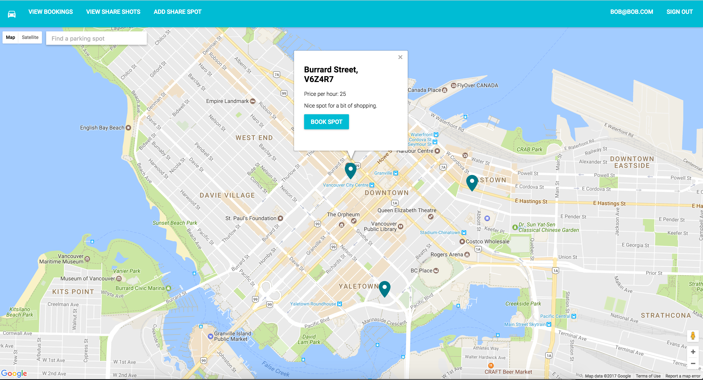

# Rent-A-Spot Self-Directed Meteor Project - Meteor, JavaScript, React, Redux, MongoDB, Material UI, CSS

### Development by Justin Levett-Yeats, Djordje Vujatovic and Jonathan Funk

This project was developed to demonstrate understanding of building full-stack web applications.  A stack of Meteor, with MongoDB, 
was used for the persistence and server-side components with React and Redux used for the presentation components.  The application 
was developed to simulate the finding and renting of parking spots with an Air BnB-style business model.

## Technologies Used

- Meteor
- JavaScript
- React
- Redux
- MongoDB
- Material UI
- CSS
- Production Tools: ES Lint, Babel, NPM / Yarn, Git

## Personal Learnings
JLY - Development of the user interface allowed me to develop a deeper understanding of React as a presentational layer and Redux for managing UI state. 
Building this application was a great opportunity for me to develop greater understanding of MongoDB. Additionally I learned much about constructing the 
project environment, setting up the dependencies and configuring the development tools.  Finally, this project was a great opportunity to work collectively 
with small development team.

DV - 

JF - For this Parking Spot project, I was tasked with implementing Google Maps React for mapping out available parking spots. 
I knew nothing about React 6 weeks ago but working with components, props, states, etc is starting to become second nature.

Google Maps React is a simple wrapper around the Google Maps Javascript API. There were obstacles learning about this library but once I got it running 
I mapped out the parking spots using data from Meteor/MongoDB.

Once I got comfortable I got ambitious and implemented this library to the Share Spot page to give the users a visual when setting up their Share Spot. 
I also changed the marker icon using customized SVGs.I’m very happy with what we made so far and I would like to keep building on to it.

## ⚛️ Deployment

#### Install
- Clone or download this repository
- Run `yarn` or `npm i` in the root to install

#### Development
- Run `meteor:debug` or `meteor [--port X]`
- For mongo `meteor mongo`
